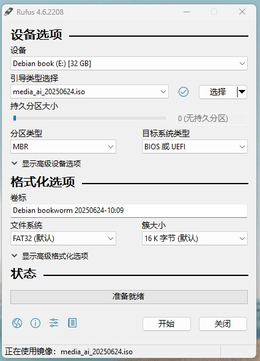

# 制作启动盘

此步骤需要在电脑上使用写盘工具将镜像文件烧录到 U盘中。U 盘在完成安装后就可推出。写盘工具可选择UltraISO、 Rufus （[Rufus4.5 下载 👍](https://download.liveupdate.fnnas.com/x86_64/packages/rufus-4.5.exe)、[Rufus 4.0 下载](https://download.liveupdate.fnnas.com/x86_64/packages/rufus-4.0.exe)、[Rufus 官网](https://rufus.ie/)）、[Balenaetcher](https://etcher.balena.io/) 等。

或

# 安装

## 选择引导盘

插入启动盘，重启电脑，进入bios（不同电脑进入bios方式不同），进入boot  设备选择界面。

选择引导盘，按回车，进入安装页面。

## 安装

选择start installer开始安装

选择语言，这里我选择中文

选择位置

配置键盘为汉语

配置系统root密码

除了root用户还可以新建一个普通用户，这里设置普通用户名（根据自己需求设置）。

配置这个新建用户的密码

对磁盘进行分区，直接使用整个磁盘即可

选择要分区磁盘

磁盘分区，可以将所有文件放在同一个分区中

完成分区操作并将修改写入磁盘

确认写入，选择是

将grub安装到主驱动器，选择是

选择引导器设备

安装完成

